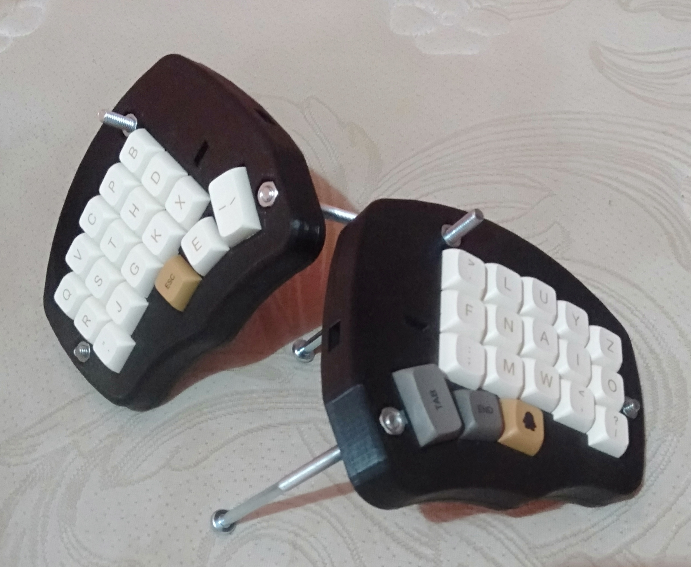

# Wadah Jagung

This repo contains some 3d printed cases for [corne keyboard](https://github.com/foostan/crkbd/) that will use M6 screws for tenting solution.

## Wadah Jagung

For 6 columns corne with 15mm bezel. (Currently not printed yet, but it should work. No guarantee, though.)

## Wadah Jagung Tipis

For 6 columns corne with 6mm bezel. (Currently not printed yet, but it should work. No guarantee, though.)

## Wadah Janten

For 5 columns corne with 15mm bezel.

## Wadah Janten Tipis

For 5 columns corne with 6mm bezel. (Currently not printed yet, but it should work. No guarantee, though.)